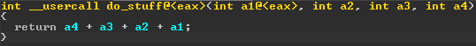
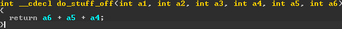

## Stack pollution

I was learning a bit of x86 ASM and realized that we can simply avoid adjusting `ESP`
Instead, we can use the size of the arguments that we didn't clean as the offset for our next function.

We still get the expected output — but disassemblers like IDA totally freak out.
This is probably already known but I thought it was interesting and wanted to share my way of testing this!

See the screenshots below:

## do_stuff

It was expected that IDA would mark do_stuff as a "__usercall" since it doesn't clean itself, still funny to see though.

## do_stuff_off

This is where it gets interesting. IDA thinks there are 6 arguments because we're accessing ebp+20, +24, and +28, but only 3 args were pushed so it's reading junk.

BONUS: On my first decompilation of main, IDA actually marked it as "__userpurge" which also; is kind of funny.